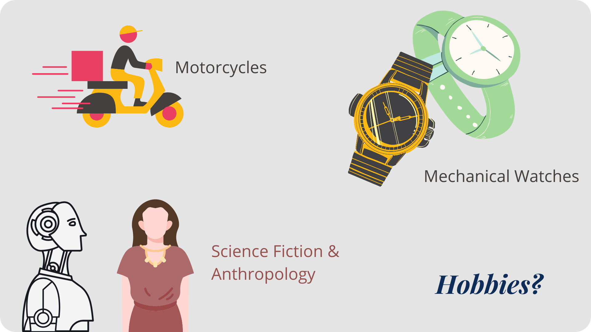
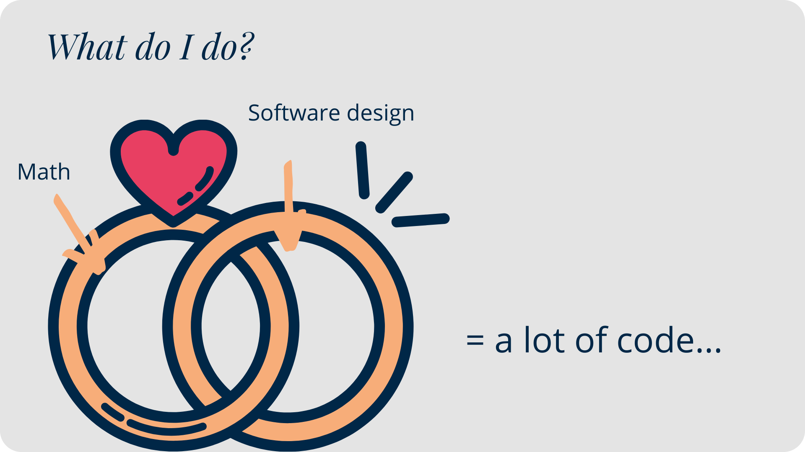

+++
title = "About"
description = "A short intro about myself"
date = "2019-02-28"
aliases = ["about-us", "mukkund1996", "contact"]
author = ""
+++

 

 

 

 

## Want to connect?
- [Email](mailto:mukkundsunjii@gmail.com)
- [LinkedIn](https://www.linkedin.com/in/mukkundsunjii)
- [GitHub](https://github.com/mukkund1996)
- [Medium](https://medium.com/@mukkundsunjii)