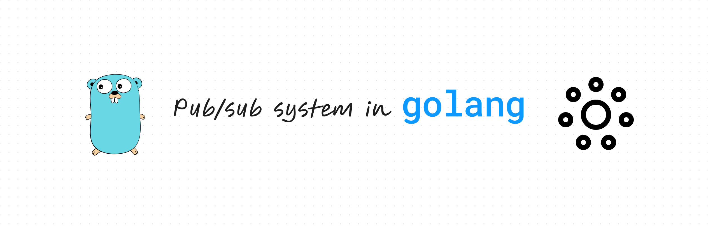
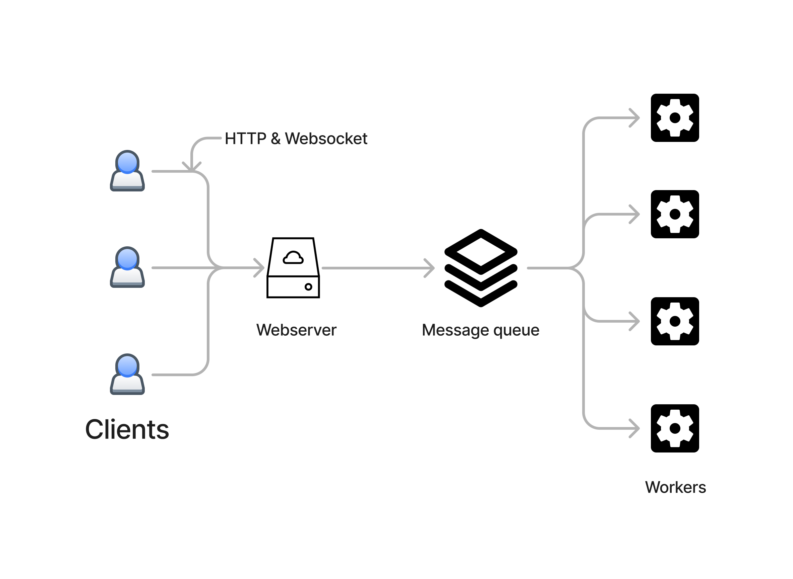
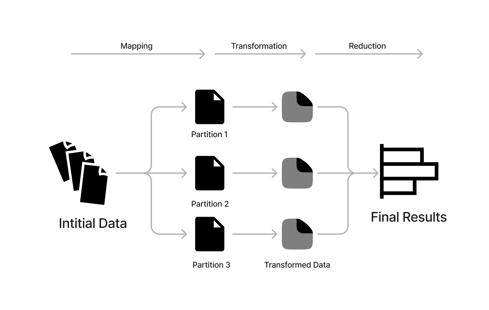
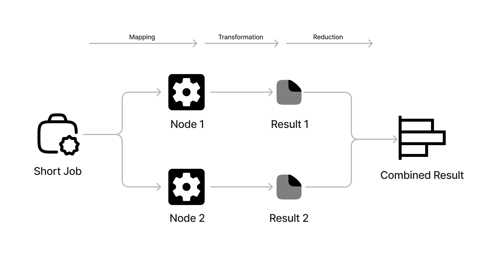
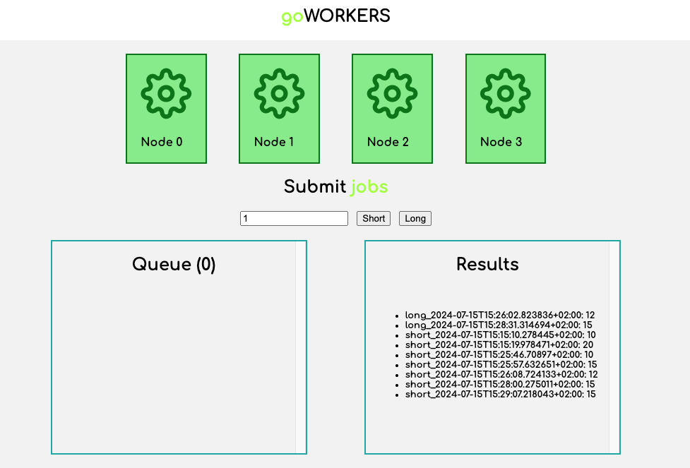
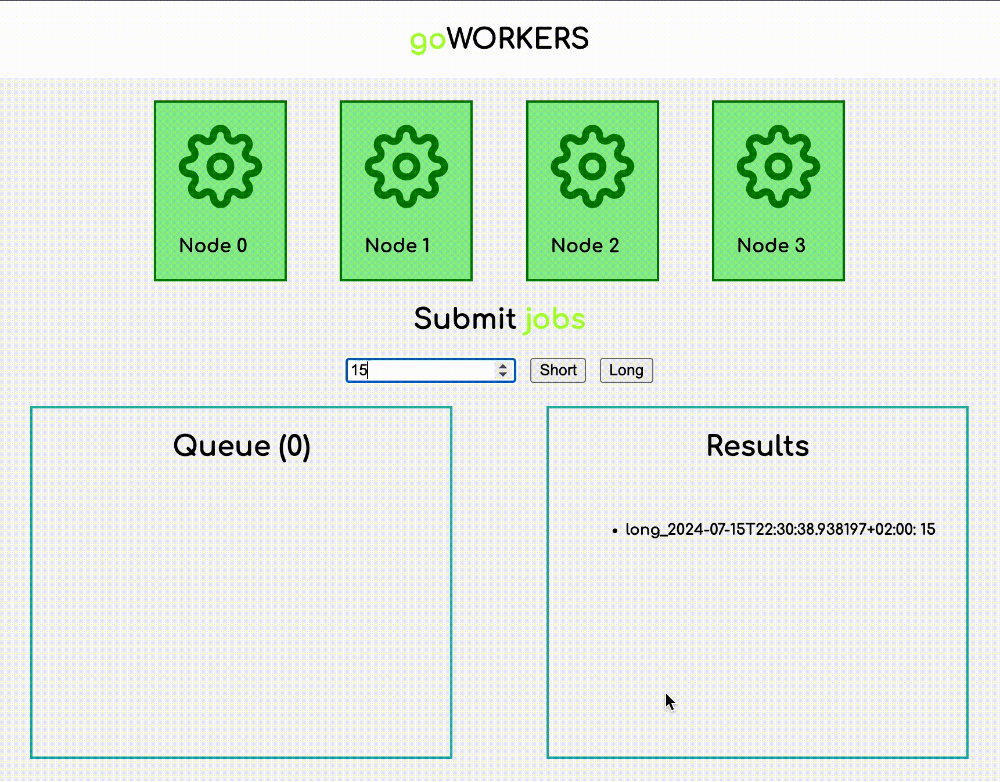

+++ 
draft = false
date = 2024-07-15
title = "Over-engineering: Building a Cluster in GO"
description = ""
slug = ""
authors = []
tags = ["go","distributed","cluster","golang"]
categories = []
externalLink = ""
series = []
+++

### Building a webserver capable of executing map-reduce jobs



Over the course of practising with golang, I'd gotten interested in learning more about go-routines and concurrent programming in general. I figured that the best way to get some reps in is to build systems that we take for grant from the ground up.

In this article, I will take you through the process of building a webserver which accepts submission of jobs which are then processed over several workers in the system using the map-reduce paradigm.

## Objective

The objective of the application is not to focus on the details of the map-reduce implementation but on how a pub/sub system works in conjunction with the client the workers and the cluster as a whole.

In the process of building the application, some important concepts are revealed:

- Queueing submitted jobs
- Monitoring the queue
- Asynchronous processing
- Reduction of results received from different nodes

## System Design



To quickly go through the system architecture, it is divided into 4 parts.

#### Web-client

- A web application that exposes a method to submit jobs.
- Displays real time status of the workers.
- Displays the job queue.
- Displays the reduced results.

#### Web-server

REST-API server that has endpoints to submit jobs and fetch information about the current state of the cluster. Based on the type of the job, an appropriate message is published to the message queue to be later processed by a worker.

#### Message queue

As the client submits different types of jobs, they are then pushed (published) to a queue. The webserver also monitors the length and the state of the queue.

#### Workers/nodes

Workers here are simply implemented as separate go-routines that subscribe to jobs/messages. Initially 4 of the "workers" are initialized and they start listening to jobs.

## Map-Reduce Jobs

To not get too wordy, a map-reduce is a way of processing large amounts of data by distributing the workload among multiple workers. For more information, please use this [reference](https://www.databricks.com/glossary/mapreduce).


As seen in the image, the map reduce generally consists of the following steps:

- Dividing or parititioning the data into different chunks, usually after sorting.
- Processing these chunks by applying some logic to them (Mapping).
- Combining the results back using a predefined logic (Reducing).

In this context, in order to focus on our objective, the map reduce looks something like...


In the application, there are 2 types of jobs (or mapping functions):

- Short jobs: A job with a map function that takes a small amount of time to complete.
- Long jobs: A job with a map function that takes a longer amount of time to complete.

For each job, the user can specify the number of partions by which the "data" is divided. Thereafter, based on the type of the job, the mapper function is run on every partition by the available workers.

Each "job" is represented by the `JobSpec` struct:

```go
type JobSpec struct {
	Id        string
	Operation func() int
}
```

Essentially a job could be an object with a UUID and a message that is associated with a routine. In this case, the job spec directly contains the function to be executed. In real production systems, the job could also contain accompanying data or other spec that is needed to perform the map step of the process.

### Mapper function

As an example, a short job mapper function would look something like this:

```go
func JobShort() int {
	time.Sleep(time.Duration(rand.Intn(5)) * time.Second)
	return 1
}
```

Keep in mind, the worker doesn't really use a "data" partion. Rather, it simulates the processing by setting a timeout for the respective thread (or worker).

### Reducer Function

Once the mapper function is finished, a separate routine monitors for completed jobs. The jobs are then collected and consolidated based on the job ID.

```go
func CollectResults(receiver <-chan models.ResultSpec, results map[string][]int) {
	for r := range receiver {
		result := results[r.Id]
		result = append(result, r.Result)
		results[r.Id] = result
	}
}
```

The reduce step is the same for both types of the jobs which just appends the results received from the workers whose length will equal the number of partitions specified in the job.

## Worker

As mentioned previously the worker is implemented as a go-routine that listens to incoming jobs. Put in golang terms, a worker can simply be defined by the following struct:

```go
type Worker struct {
	Id    int
	Busy  *bool
	JobId *string
	r     <-chan JobSpec
	s     chan<- ResultSpec
}
```

Each worker is initialised with a receiver and sender channel. Through the receiver, the worker receives a `JobSpec`. On the flip side, each worker also has `sender` channel which is used to send the calculated results of the map step.

The workers are created and intialized when the webserver is started with the following methods:

```go
// Initializing the workers
for i := range workers {
		workers[i] = models.CreateWorker(i, sender, receiver)
	}

// Starting the workers
for i := range workers {
    go workers[i].StartListening()
}
```

## Monitoring the queue

A job queue implementation is not explicitly required as the act of sending or receiving messages in a channel is a blocking command in Golang. However, in order to visualize the queueing of the jobs, a separate queue or array of job IDs is maintained and shared through an endpoint.

```go
func RunShortJobs(s chan models.JobSpec, jobs *[]string) func(c *gin.Context) {
	return func(c *gin.Context) {
		numWorkers, err := strconv.Atoi(c.Param("numPartitions"))
		if err != nil {
			return
		}
		reqId := utils.GenerateId("short")
		c.IndentedJSON(200, gin.H{
			"status": "Submitted",
			"job":    reqId,
		})
		for i := 0; i < numWorkers; i++ {
			*jobs = append(*jobs, reqId)
		}
		for i := 0; i < numWorkers; i++ {
			jobSpec := models.JobSpec{Id: reqId, Operation: utils.JobShort}
			s <- jobSpec
			*jobs = (*jobs)[:len(*jobs)-1]
		}
	}
}
```

In the above code snippet, the function is the controller of an endpoint exposed by the webserver. Here, the variable `jobs` contains the jobs that are yet to be picked up.
The moment a user submits another short job with a specific n number of partitions, then n short map jobs are added to the queue. As the jobs are consumed and completed by the workers, it gets popped from the queue.

## Web client


The web client is build using Vue.js. It is a simple interface that lets users accomplish the following activities:

- Submit jobs
- Visualize worker status
- Visualize queues
- Keep track of the results of the submitted jobs.

### Job Submissions

The clients uses HTTP endpoints exposed by the webserver to submit jobs.
For example:

```http
### Check status of workers
GET http://localhost:8080/status

### Submit a job with 1 parition
POST http://localhost:8080/short/1

### Submit a long job with 3 paritions
POST http://localhost:8080/long/3
```

### Visualization

The web client uses the following websockets to show real-time status of the map-reduce cluster:

- `ws://host/queue` - sends the current jobs in the queue
- `ws://host/status` - sends current status of the workers
- `ws://host/results` - sends the updated list of results

## Demo

Lets see how it all works when put together:


#### So what is happening here?

- The user submits two jobs where the partition parameter is set to 15.
- Both of the jobs take place asynchronously.
- The workers then pick up the published map jobs.
- The results are collected and the progress of the job can be seen in the results section.

<br>

## Want to Connect?

Thank you for reading my article. You can also find me on [LinkedIn](https://www.linkedin.com/in/mukkundsunjii/) and my work on [GitHub](https://github.com/mukkund1996).
