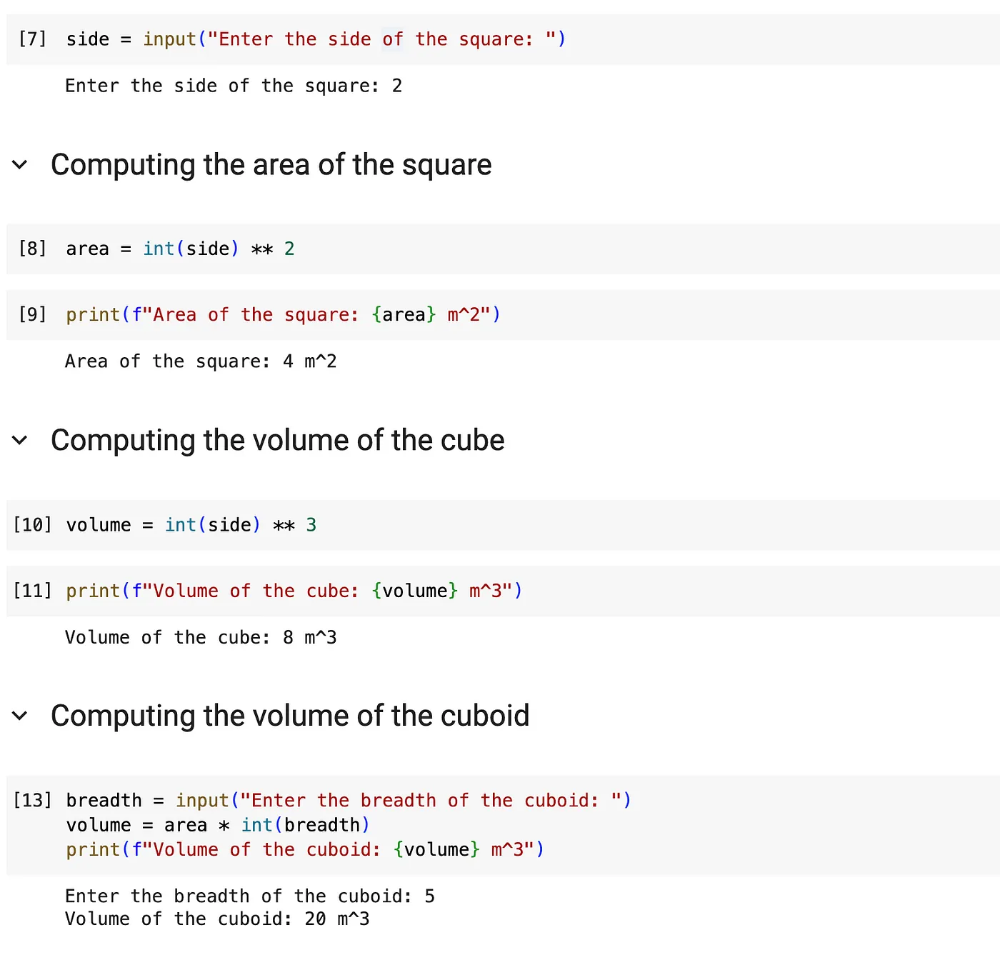
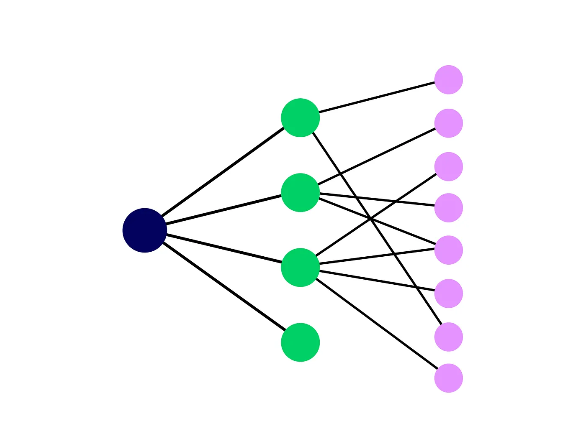
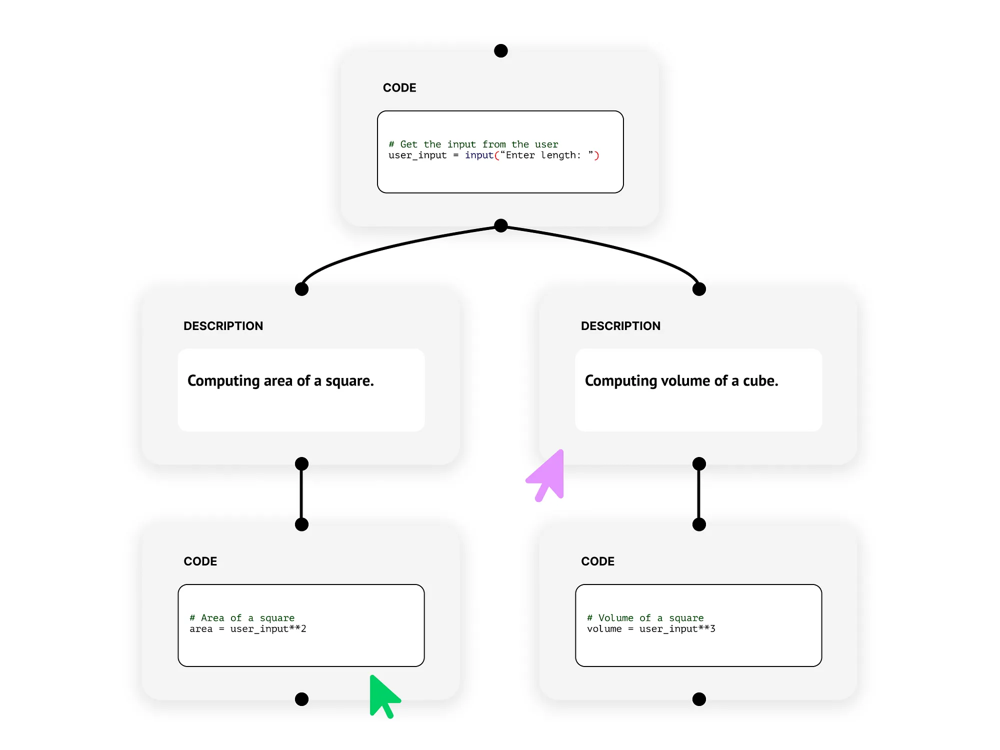
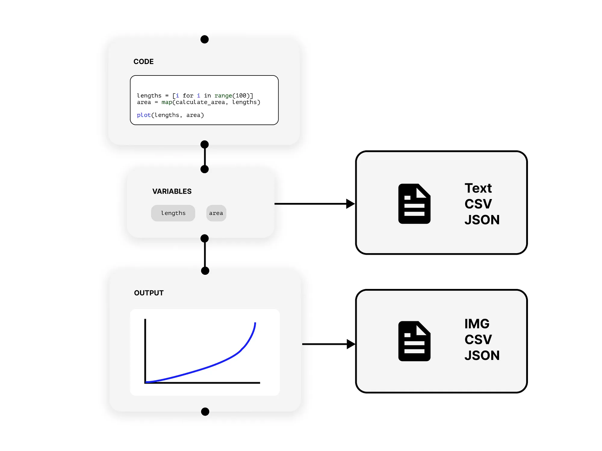
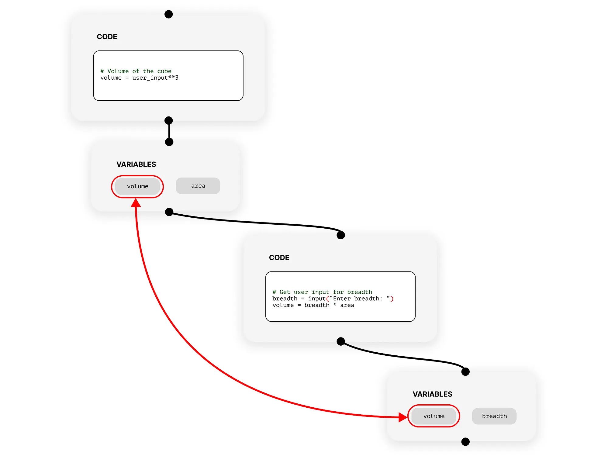

+++ 
draft = false
date = 2024-01-01
title = "Something is Wrong with Python Notebooks"
description = "Can we iteratively design a better solution?"
slug = ""
authors = ["Mukkund Sunjii"]
tags = ["jupyter","python","web"]
categories = []
externalLink = ""
series = []
+++

Ahhh Python notebooks… We all love them for how they revolutionized and shifted the programming paradigm. By stripping away the excess fat like generating builds, manually running, and maintaining runtimes, it has drastically reduced the bar to entering software development and paved the way for data science and engineering.

But this does not mean that it comes without faults…

## So what is wrong with them?

Consider a simple piece of code that computes the area of a square given the length of the side.

### Let's examine the code…
Long story short, all the code tries to do is simply compute the area and the volume based on a length (and the breadth depending on whether it is a cube or a cuboid).

I already see design problems with this code (keep in mind that these are subjective). I will list them all below:

### Problem #1 — Divergent flows of logic
As you might see from the user inputs and print statements, there are potentially multiple objectives and user interaction points in the program. However, due to the rigid constraint of representing code in a linear 1-dimensional fashion, this might take time to be apparent.

### Problem #2 — Mutation of variables
Notice that in the last code cell, the variable volume is being used to represent two different pieces of information:

- Volume of a cube — that uses only the length of the side.
- Volume of a cuboid — that uses the area and breadth of the cuboid.
- This not only poses the problems of mutation but, also muddies the implementation details.

### Problem #3 — Flow of information
By the flow of information, I mean the dependencies of coding cells to the variables defined in preceding cells. Let me illustrate:

- Cell [10] uses a variable side defined in Cell [7].
- Cell [13] uses a variable area defined in Cell [8].

### Okay, do you have a better idea?
While some of the above “problems” are due to the inner workings of the Python kernel, a lot of the readability issues can be fixed by tweaking how we create and read pieces of code. In the following section, I will try to explain an improved design of the notebook using low-fidelity prototypes.

*Note: I refer to code and markdown cells as nodes in the new design.*

2(D) is better than 1(D)

Human brains work in exceptionally complex ways. Mirroring the workings of the neurons, we tend to perceive, process, and act using decision trees. We start with a single piece of information and subsequently branch out to other, connected sources of information.

### So why not replicate this in programming?

Instead of constraining ourselves to write linear programs, adding another dimension brings about a wealth of advantages:

- The intention and implementation of the solution are immediately clear and do not need additional clarification.
- The flow of information is also straightforward — the user_input is used to compute the area and volume of the entity.
- Opens up additional possibilities of collaborative coding similar to the likes offered by Miro.

### Introducing new node-types

In the new design, I propose to treat everything as individual entities or nodes that are connected to other nodes. This includes the standard output and also the runtime variables that result from a code node.

#### Variable and output nodes would offer:

- More transparency — the user knows exactly the information upon which they can act.
- Opportunity to improve the IO since a lot of operations in data science involve serializing and deserializing variables and outputs of a piece of code.

### Demystifying the flow

The problem of mutation illustrated earlier using the Python notebook is now glaringly visible in the prototype. While the variable is still being mutated, the user would still be able to use both versions of volume by simply branching out from the appropriate variable node.

Note that this does involve modifying how the kernel executes the preceding cells.

## What do you think?

I would love to hear feedback on the issues discussed here and also on the proposed design.

If you would like to try and interact with the new design, I have created a web application called GrphBook. You can check it out [here](https://mukkund1996.github.io/grphbook/). It is an open-source project and is therefore open to contributions.

## Want to Connect?

Thank you for reading my article. You can also find me on [LinkedIn](https://www.linkedin.com/in/mukkundsunjii/) and my work on [GitHub](https://github.com/mukkund1996).
