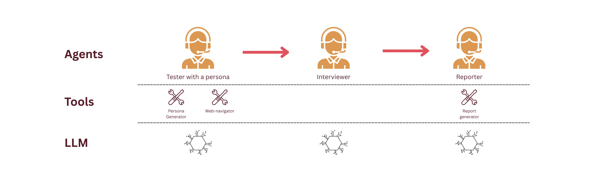
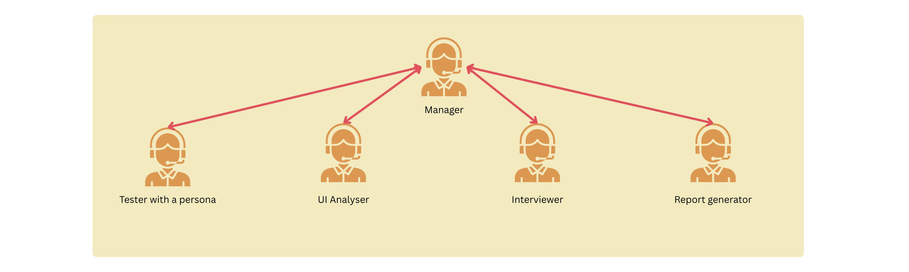
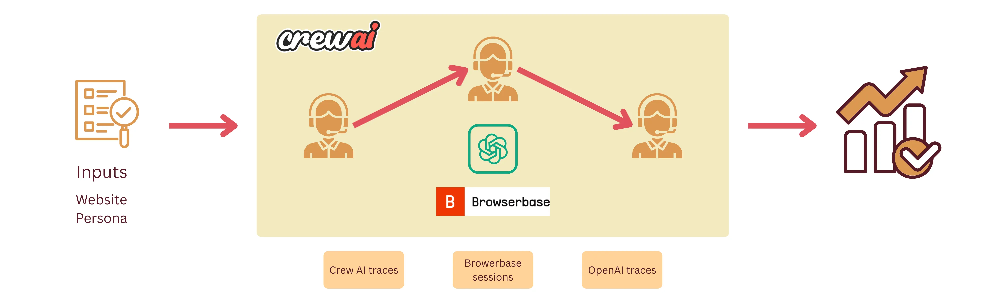
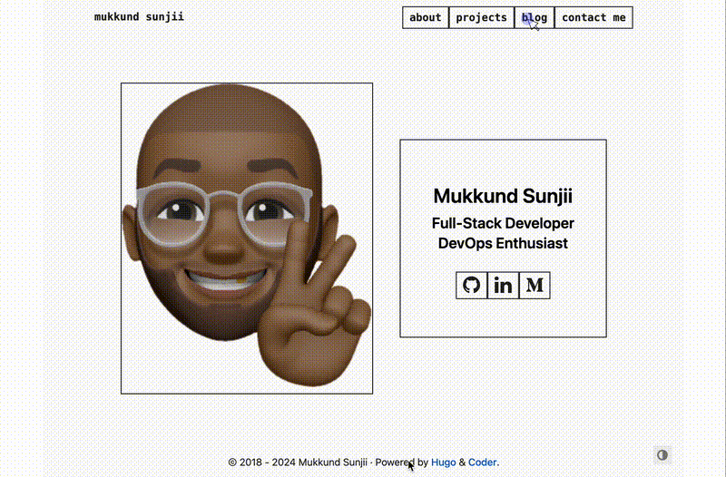

+++ 
draft = false
date = 2026-01-07
title = "Building an AI product using AI — Part 1"
description = ""
slug = ""
authors = ["Mukkund"]
tags = ["product","agentic-ai","agents","product-managment"]
categories = []
externalLink = ""
series = []
+++

### and the struggles with my AI Agents…

*Disclaimer: Every word is written by a human — but it still comes with hallucinations and delusion.*

The product landscape in the last couple of years has really been “revolutionized” by AI. We’ve seen some great products that show a glimpse of perfect harmony and integration of AI and some really really bad ones — we’ve all been there and said, “do you really need a chatbot in this application?”.

I’ve learnt that writing code is being (or already has been) commodified. The real challenge for engineers and for product is to find innovative solutions that can be enhanced by AI and not mindlessly retrofitted on to.

After having looked at a lot of silly AI startups pop up over the last couple of years, I was like, how hard could it be? (Spoiler: it was surprisingly hard) So I am gonna give it a shot and build it in the open. And for the first time, I am gonna build it in an “AI-native” way — a.k.a a lot of copilot, reviewing and re-prompting. In this article, I am gonna attempt to document my struggles, methodology and frustrations working with AI tools.

# The goal 🚅

*From this point forward, I will call the application “Product-Eye”*

I would like to build a product that given a URL of a website or a web-app, it would be able to use the application with a pre-defined persona and record observations and potential improvement points. Finally, it should be able to simulate user-interviews and provide a product development roadmap for the short-term future.

## Target users

Product Managers — After every release of a version, or a small PoC, Product-Eye can be used to conduct simulations of user-testing to quickly get feedback on major usability blockers that was uncaught during development.
Product Marketing— Competitive analysis is a great companion feature for Product-Eye, where the product is compared against other similar products in the market to test for feature parity.

## What’s in v0? 🏃

I would like to keep it super simple for version 0. Only the following will be included:

A simple Agentic workflow that accepts the 2 inputs — website URL and the persona and returns a report containing summary about the user interview and product roadmap.
The agent will visit the website, interact with it and record observations.
A separate agent will simulate an interview with the user-persona using the observations of the testing.

## And now for the ‘How’? 🤔

I decided to use CrewAI as my agent building/orchestration framework for the following reasons:

- CrewAI already comes pre-built with a lot of scaffolding involving agent interaction, logging etc. Long story short, I found that it is very easy to get started and build powerful tools using CrewAI. Am I gonna regret it later in the future? Maybe 😆
- I want to build it in Python (I’ve not done anything in Python in the last 3 years) — I wanted to test how much I could get away with not being completely proficient with a language by relying on copilot.
- A bunch of community tools that came in with CrewAI which came in clutch for this project.

## Agent design 🤖



### Tester

Tester with a predefined persona. Ideally depending on the type of the product that the tester needs to test — for example, a persona would be a structural engineer, or an accountant.

Since it is by far the most complex agent in this product, here is the configuration:

```yaml
persona_navigator:
  role: >
    Persona-Driven Web Application Navigator and User Behavior Simulator
  goal: >
    Navigate and interact with web applications using automated browser tools while
    simulating realistic user behavior patterns based on specific persona profiles
    to generate authentic user feedback and testing insights for {app_url}
  backstory: >
    You're an expert in both web automation and behavioral psychology who specializes
    in persona-driven testing. You excel at navigating web applications through the lens
    of different user types, combining technical web automation skills with deep understanding
    of how various personas interact with technology. You use tools like Stagehand to explore
    applications while authentically replicating user behavior patterns, preferences, and
    decision-making processes of different user personas.
```

### Interviewer

The “person” responsible for interviewing. Currently, as a simplified setup, the agent just simulates the information based on the observations made in the first step. More robust setup would be to directly have the tester and interviewer talk amongst each other.

### Reporter

Quite straightforward, and honestly could’ve just been a procedural command to generate the report. The agent is responsible to summarize and report on the findings of the tester and the interviewer.

## And now the struggles… 💁

*(and the most valuable part of this article)*

Much has been said about how generative AI could now enable non-engineers to craft digital products. Although technically true, I think it is still a dream. I, as an already experienced software engineer, spent hours on debugging, trying to find alternatives and reading documentation. Let me recount some of the nightmares below.

### Challenge #1: Do as I say, please 🙏

I kicked off the project using a simple setup command from CrewAI. Following that, I provided a set of prompts to copilot to translate the ideas in my head to code. Here was the initial prompt:

```
I want to build a product that would do the following given a url. 
- The product would need to contain a tester that would be able to visit the 
url, test the webapp and record the interactions. The tester needs to have 
a simulate a given persona.
- I want to simulate a user-interview with the tester and ask about the experience 
and potential improvements. 

...more instructions

Lay out the steps one by one and make changes in small batches. Do not create 
the whole product in one go!!
```

So how did it do?



The first iteration was rather complex, verbose and contained a bunch of things that I didn’t wanna have in the first version.

- Instead of a sequential, the workflow was hierarchical. A manager agent was responsible for orchestrating the processes. Granted it was more autonomous, it came in with a lot of problems in terms of result replicability and transparency. There were times when the agents got stuck in an infinite loop.
- Bunch of extras — there was a UI analyzer that used openCV to visually analyze the product for spacing, fonts and readability. Although it looked cool, keep it simple stupid (at least for now)!
- Verbose tools — the tools that the agents used were doing too much. They were super verbose and highly non-testable.

In the end, I spent a bunch of time cutting down the amount of code, re-iterating on the agent spec and reduce the complexity of the workflow.

Here is the final design of the workflow:



### Challenge #2: Do you even click, bro?


By far my biggest challenge and bottleneck was adding a tool to browse and interact with the web. Now I know, what you’re thinking — I could’ve just used the several million services already available that allow agents to use browsers.

Silly me, thinking that I could re-invent the wheel, I started with a very simple set of playwright commands to do the following actions:

- Click
- Scroll
- Search elements

### Unsuccessful…

Next, I tried out the playwright browser toolkit from the Langchain community. Since, they cannot be directly used, I created wrappers for them to pass them as tools for the crew agents.

What I found next was frustration. Experiment after experiment, token after token, the agent tried to click on elements that were not clickable or type on elements that didn’t exist. I tried the following:

- Looked at CrewAI ephemeral traces to try and focus on the exact failure point.
- Upgraded and/or changed LLM models that are more optimized for the problem.
- Added fallbacks when performing actions on the selectors

```py
try:
    elements = page.locator(selector).all()
    if not elements:
        suggestions = []
        if selector.startswith(".") and "link" in selector.lower():
            suggestions.append("Try: 'a' for all links")
            suggestions.append(
                "Try: 'a[href]' for links with href attribute"
            )
        elif "storylink" in selector or "title" in selector:
            suggestions.append("Try: 'a' for links")
            suggestions.append(
                "Try: 'h1 a, h2 a, h3 a' for title links"
            )
        ...
        suggestion_text = (
            "\nSuggestions:\n"
            + "\n".join(f"   - {s}" for s in suggestions)
            if suggestions
            else ""
        )
        return f"No elements found with selector '{selector}' on {current_url}{suggestion_text}"

except Exception as e:
    return f"Invalid selector '{selector}': {str(e)}\n💡 Try using basic selectors like 'a', 'button', 'input'"
```

### Unsuccessful…

Finally, as a last resort, I looked for alternatives in the market where I came across 2 tools:

- Stagehand by Browserbase
- Browser-use
 
I chose to go with Stagehand as it was supported by CrewAI out of the box. Lo and behold, I had tons of trouble setting it up because of an environment variable not being loaded correctly. Combined with the inexperience with UV (a dependency manager by Python), it took a lot of reading up the docs and debugging to get myself going. In this case, copilot absolutely couldn’t help me because of how new to the market some of the tools were.

And just like that, after all of the struggle, I was able to let my agent explore the simplest website in human existence 🙌


There is a bit of divine comedy in how an AI agent manages to pick an article that is named “Pausing AI developments isn’t enough”.

### Challenge #3: Are you a robot?


Due to the rather primitive nature of the agent, it is completely blocked when it comes across safeguards against crawlers. But, of-course, this is not entirely an issue as the application is meant to test in-house products that are running without bot detectors.

However, it is interesting to note that fallbacks need to be implemented in other scenarios when the tester agent is completely blocked. In this test case, the bottleneck (i.e., the captcha verification) is reflected in the final report:

```md
# Excerpt the report
## Interview Highlights and User Feedback
### Key Insights from User Interviews
- **User Sentiments:** Users report feeling relieved due to fast loading times and minimal clutter, which contributes to a more efficient experience.
- **Strengths Identified:**
  - Quick navigation and responsive design.
  - Relevant and well-organized content.
- **Weaknesses Noted:**
  - CAPTCHA verification could present an unexpected friction point.
  - Lack of advanced sorting or filtering options for navigating content.
```

## Some other observations…

In the current setup, the results vary widely based on the given persona. This is expected but the persona description needs to be taken into careful consideration.

Right now, there are the following personas:

- Novice
- Accessibility-focussed
- Tech-savvy
- Mobile-first

Although the personas don’t align with the product ethos of matching the tester’s profession, they will do okay for now. Each persona has a certain set of configuration that is used in the persona_generator tool. For example, for a tech-savvy user, the following is the config:

```yaml
"tech_savvy": {
    "demographics": {
        "age_range": "25-35",
        "tech_proficiency": "high",
        "device_preference": "desktop",
        "internet_experience": "expert",
    },
    "behavior_patterns": {
        "navigation_speed": "fast",
        "error_tolerance": "low",
        "exploration_tendency": "high",
        "shortcut_usage": "frequent",
        "multitasking": "high",
    },
    "timing_patterns": {
        "between_actions": (0.5, 2.0),
        "reading_time": (0.5, 1.5),
        "decision_time": (0.2, 1.0),
    },
    "preferences": {
        "keyboard_shortcuts": True,
        "advanced_features": True,
        "efficiency_focused": True,
        "customization": True,
    },
    "pain_points": [
        "Slow loading times",
        "Unnecessary confirmation dialogs",
        "Limited customization options",
        "Lack of keyboard shortcuts",
    ],
}
```

# Results from tests

I thought it would be a good and easy test case to run the application on my own portfolio website. The resulting report was fascinating to say the least 😛

## With a tech-savvy user:

Press enter or click to view image in full size



```md
# Excerpt the report
### Observations
1. The homepage offers clear access points, facilitating intuitive navigation.
2. Project details and code repositories are accessible, catering well to user proficiency.
3. The blog section provides varied tech-focused articles, enriching user exploration.
```

- The agent focussed too much on the keyboard shortcuts.
- Pointed out some potential improvements on the organization of the blog.

### With a Novice user:
```md
# Excerpt the report
**User Feedback Summary**:
- "The homepage felt simple, but I needed more directions."
- "The 'Projects' section was overwhelming with all the jargon."
- "I wished for clearer contact methods with instructions."
```

- The results were widely off and contained quite a lot of hallucination.
- There were some nice critiques about the contact me page: “I wished for clearer contact methods with instructions.”
- The test clearly indicated the lack of context from the agent to perform actions on the website.

# Looking towards part 2
- *Focus*: Currently the product is still doing too much and the vision is vague. Should it be more focused towards static websites as opposed to single page applications — which is considerably more complex.
- *Hallucination*: A lot, a lot, a lot of hallucination. The metrics, loading times, error rates in the website are sometimes being hallucinated. The prompts need to be sharper and more explicit.
- *Context*: Just the website URL and the user persona are not gonna cut it. There needs to be further instructions and context about the persona that needs to be provided to the agent to carry out specific tasks.
- *Agent Feedback Loop*: An additional agent could be introduced to monitor and evaluate the tester’s results. It is a common pattern in Agentic AI that might be well-suited in this case.
