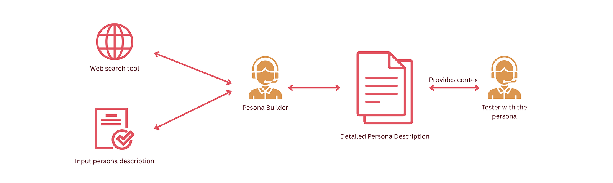
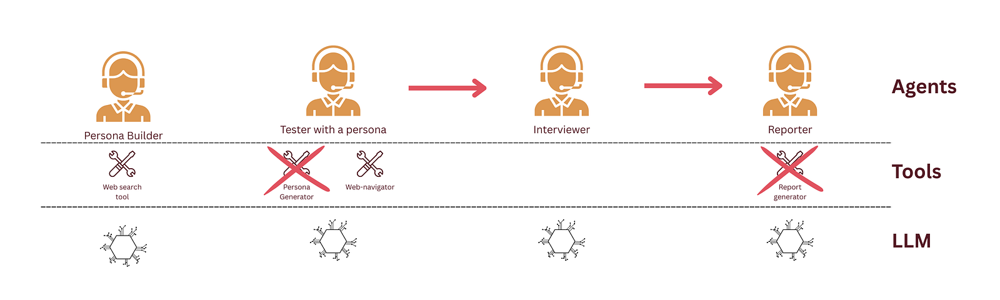
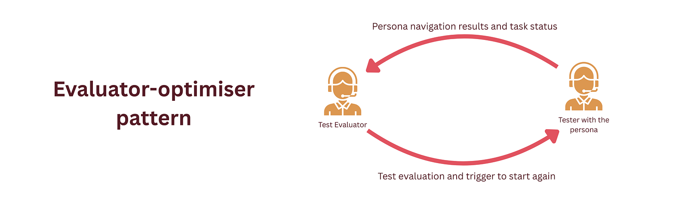
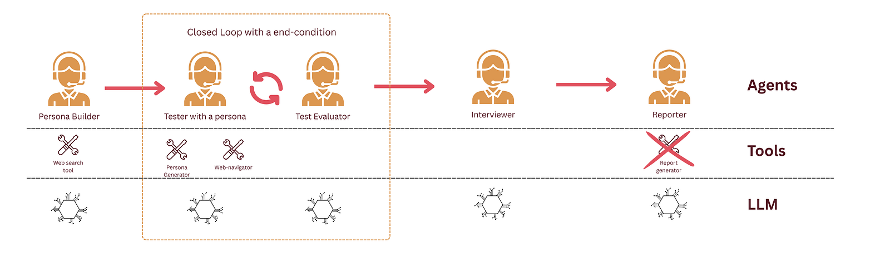

+++ 
draft = false
date = 2026-01-14
title = "Building an AI product using AI — Part 2"
description = ""
slug = ""
authors = ["Mukkund"]
tags = ["product","agentic-ai","agents","product-managment"]
categories = []
externalLink = ""
series = []
+++

### removing and introducing complexity in my agent trio…

*If you missed the previous part in the series, pre-prompt yourself by reading [part 1](https://medium.com/gitconnected/building-an-ai-product-using-ai-part-1-90c30ea9a834) for more context.*

# What is the theme of this part?

The main motto of this iteration of the developing my product (called Product-Eye) is the following three mantra's: 

- Reduce
- Remove
- Improve

# What am I reducing? 

After some deep thoughtful conversations with my favorite AI agent and running the workflow several times, I realized (as stated in the conclusion in part 1), that I needed to re-focus the vision of Product-Eye. 

The first iteration was doing far too much in terms of the output:

- A very broad persona that is not only non-physical but also quite vague. For example in v0, the persona used was "tech-savvy" which says nothing to me as a real world user. 
- The persona coming up with an entire test plan to explore the web application.
- Generating a lot of redundant metrics for the report such as performance metrics, error rates etc.

So, what did I do to address the above concerns: 

## Provide more context to the persona

As mentioned before, the only input in v0 was the web URL and the persona type. In the real world, a beta-tester would already be provided a broad set of instructions to perform in the application. The resulting interactions from the user could then be used to evaluate the shape of the product roadmap. 

Along those lines, a set of test_instructions are provided that would provide the tester agent with the necessary context to engage and perform actions on the web application. 

In this case, the following input is also required for the persona testing task:

```yaml
testing_instructions:
  description: >
    The exact testing instructions that were provided to the persona navigator.
    Use these as the verification criteria to assess completion quality.
  type: list
  required: true
  structure:
    - task: "High-level goal or objective to accomplish"
      priority: "high|medium|low"
      max_attempts: 3
      success_criteria: "General outcome that indicates task completion"
      fallback_action: "What to do if the task cannot be completed"
```

## Create a better Persona



A rather severe limitation in the v0 was the poor quality persona that was: 

- Limited: the description of the persona was severely limited to a certain set of specs
- Rigid: the end-user of the product aws limited to certain set of personas
- Non-Physical: it did not reflect real world personas that would actually take part in user-testing. 

As a result, given a persona which could be completely unique for a certain web application, a new task was introduced in the agentic workflow. It will be called the persona_research task and will be carried out by a persona_research agent. This task will be performed to build a more complete narrative for the persona including past experiences, pain points and general application preferences. 

To improve the agent, the agent was also "highly" recommended to do web-searches (through SerperDevTools) in the process of building out the persona. 

The final persona would look something like this:

```py
class PersonaResearchOutput(BaseModel):
    """Structured output for persona research task."""

    persona_type: str = Field(..., description="Type of persona researched")
    professional_background: Dict[str, Any] = Field(
        ..., description="Professional context and typical responsibilities"
    )
    technology_profile: Dict[str, Any] = Field(
        ..., description="Technology proficiency, preferences, and usage patterns"
    )
    behavioral_characteristics: Dict[str, Any] = Field(
        ..., description="Behavioral patterns and interaction preferences"
    )
    work_context: Dict[str, Any] = Field(
        ..., description="Work environment, constraints, and pressures"
    )
    pain_points: List[str] = Field(
        ..., description="Common frustrations and challenges with technology"
    )
    decision_factors: List[str] = Field(
        ..., description="Key factors that influence their decision-making"
    )
    research_sources: List[str] = Field(
        ..., description="Sources used for gathering persona information"
    )
    key_insights: List[str] = Field(
        ..., description="Most important insights for user testing simulation"
    )
```

The resulting personas was worlds better. The need to manually enrich the input ourselves was eliminated by empowering the persona builder agent with the power to conduct web-searches. This resulted in comprehensive web-personas with crucial information about the pain-points of a given persona which might not be immediately available to a product manager.

# What am I removing?



This was an easy task. There were still tools that were doing too much and were still untestable (thanks copilot). It was especially the case for report generation which, after testing, was mostly either failing or producing undesirable outputs. 

In order to simplify the output, I decided to simplify the workflow and remove the tool altogether. There are pros and cons to this approach. 

### Cons:

- Less deterministic outputs.
- No more serialized outputs that can be used by other downstream applications for visualizations.

### But the Pros outweigh the objectives of the current version: 

- Removes a ineffective tool and reduces dependency on non-maintainable code.
- Simplifies the approach.

With the removal of this tool, the workflow now, does not use any custom-tool. The only tools used are the ones from external libraries.

# What am I improving?

Now for the exciting part, to improve the output of workflow. Currently as it is, there is no oversight for the persona_tester agent. Meaning, what the agent does is the only truth and there are no alternatives. 

## Evaluator-optimizer Pattern



A great Agentic pattern that is ripe for this use-case is the evaluator-optimizer pattern. In order to have an oversight on the performance of the tester, a separate agent will now supervise the tester and check the outputs of the task. Lets call it the *tester_monitor*:

```yaml
tester_monitor:
  role: >
    Navigation Task Verification Specialist
  goal: >
    Monitor and verify that persona navigation tasks are completed satisfactorily
    according to the provided testing instructions, providing feedback for improvement
    when tasks are incomplete or unsatisfactory
  backstory: >
    You're a meticulous quality assurance expert who specializes in validating
    user testing completion. You excel at analyzing navigation reports against
    specific testing criteria, identifying gaps or incomplete tasks, and providing
    clear, actionable feedback to ensure thorough testing. You understand the
    importance of respecting max_attempts limits while ensuring quality standards
    are met. You provide constructive feedback that helps navigators improve
    their testing approach without being overly critical
```

The *tester_monitor* agent will now output a set of specs that would provide the *persona_tester* agent with the following information:

- Completion status of the task
- Comments about success criteria of the task
- Whether or not the agent should retry this task with a different route

The improvements were two-fold:

- It drastically improved the success rates of the persona_tester to complete the test instruction albeit after a few tries. 
- If the task was not able to be completed, it provided enough context for the reporter agent to judge whether it was the problem of the web-app or of the agent.

## Hallucinations

In the process of improving, I tested the agents with a variety of different websites and applications including products that were content-rich, SaaS offerings, collaborative tools etc. The tests led me to the conclusion that there was still quite a lot of hallucinations in the output: 

- The interviewer and interviewee making things up that absolutely did not happen in the navigation task. 
- Super inaccurate timestamps, made-up performance metrics in the final report.

With a bit of prompt engineering and trial-and-error, the hallucinations were brought down largely. Using strong language and strict guidelines definitely helped. Something like:

```md
MAKE SURE THAT THE INTERVIEWER AND THE INTERVIEWEE DOES NOT MAKE UP THINGS THAT DID NOT OCCUR during the navigation task.
There should NOT BE ANY hallucinations in the interview.
```

# Final Setup for v1.0



# Some interesting results

Same as last time, I had similar (if not the same) test candidates to make a comparison. 

## [HackerNews](https://medium.com/r/?url=https%3A%2F%2Fnews.ycombinator.com%2F)

This time, the recommendations and problems faced by the persona agent were a lot more relevant thanks to the detailed persona building step. Some suggested recommendations were the following:

```md
**Recommendation:** Refactor the navigation bar to improve the visibility 
of key links, particularly "Ask HN." Consider using a more prominent color, 
larger font size, or a different placement within the layout.
**Recommendation:** Implement a tagging system for submissions, 
allowing users to filter content based on technologies (e.g., React, Node.js), 
topics (e.g., security, architecture), or frameworks. 
This will require modifications to the submission form and the 
front-end display logic.
**Recommendation:** Enhance the display of submission previews to provide 
more context before users click on a link. This could include displaying the 
first few lines of the linked article or a summary generated by an AI model.
```

Note that the recommendations seem to be similar from last time, however, the readability and reliability has improved a lot (IMO) due to the better persona defintion. 

## [My Portfolio Website](https://thisismukkunds.site)

This was the most surprising result. I used the following as the input and tasks:

```yaml
app_url: "https://thisismukkunds.site/"
persona_type: "recruiter or hiring manager looking to evaluate a candidate's portfolio"
testing_instructions:
  - task: "Navigate the portfolio structure and main sections"
    priority: "high"
    max_attempts: 3
    success_criteria: "Understand the overall portfolio structure, identify main sections (about, projects, contact, etc.)"
    fallback_action: "Document what sections are visible and navigable, note any navigation issues"
  - task: "Review the person's background, skills, and projects"
    priority: "high"
    max_attempts: 2
    success_criteria: "Explore showcased projects, understand the person's skills and experience through their work"
    fallback_action: "Document available project information and presentation quality"
  - task: "Test contact and interaction features"
    priority: "medium"
    max_attempts: 2
    success_criteria: "Test any contact forms, social media links, or interactive elements on the site"
    fallback_action: "Document available contact methods and their accessibility"
```

In the interview transcript, the user (in this case, acting as the recruiter) clicked on a project that I'd made in the past called Grphbook. Here's what they have to say about it:

```yaml
**Interviewer:** You click on the "GrphBook" link. Tell me about what you 
see on the project page itself.

**User:** Alright, I see a description of the project, and a section 
dedicated to the tech stack used.

**Interviewer:** What information are you hoping to find on this page?

**User:** I'm looking for specifics. What problem did this project solve? 
What was the candidate's role? What technologies did they use, and most 
importantly, what were the results? Did it improve anything? Were 
there any measurable outcomes? Also, a visually appealing layout helps 
immensely. Walls of text are a huge turnoff
```

All in all, I will say that there is a common theme in the results, in that they are a lot more relevant to the given user persona. The results can further be improved through better task definitions and persona specificity.

# Next Steps

With the most important improvements out of the way, it is time to focus on the most difficult task of agentic applications, the interface to the user. I believe that this is the single most important (and underrated) aspect as it makes or breaks the product. 

## Less is more

With the introduction of LLM's, any application can produce a slew of text based recommendation. But, users of today are already overwhelmed and saturated with AI-generated content. Therefore, presenting them with the right piece of information from the deluge of content produced by the agent is a challenge in itself. 

This is exactly what I would focus on the next part.