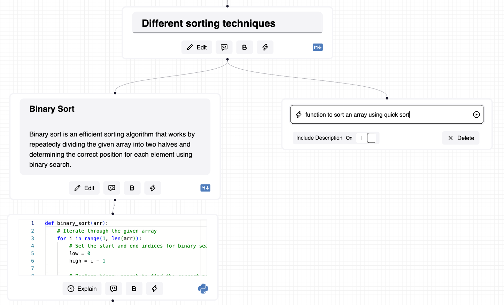
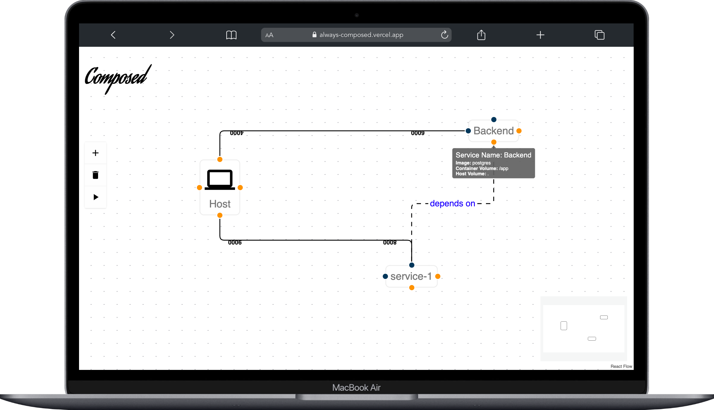
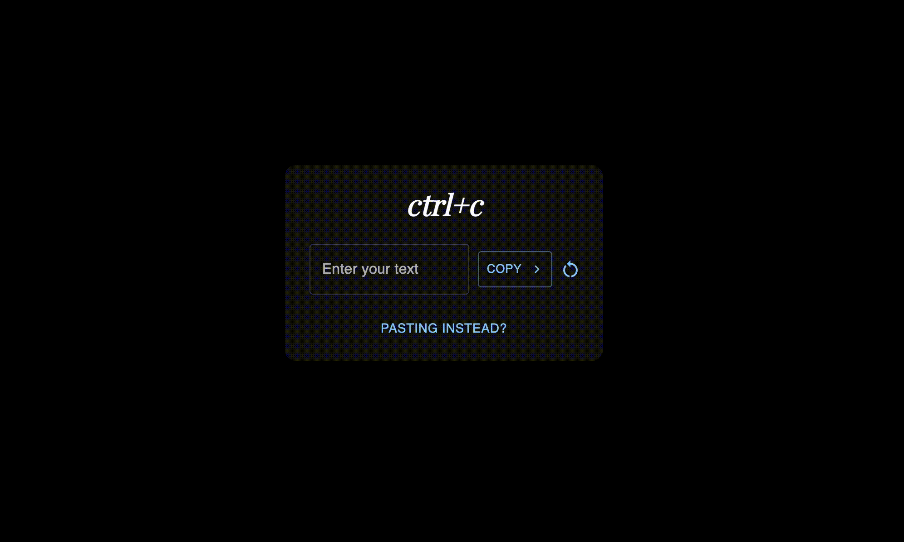

+++
title = "Projects"
slug = "projects"
+++
 

# GrphBook

Grphbook is a web-based application that allows users to create graphical representations of python notebooks. It allows you to represent complex workflows using simple nodes augmented with useful AI features.

## Tech Stack

#### [Website](https://mukkund1996.github.io/grphbook/)
#### [Demo](https://grphbook.vercel.app/)

# Composed

A simple, and an elegant web-based GUI for docker-compose. Create your microservice powered systems diagramettically and let `Composed` generate the docker-compose configuration files.

## Tech Stack
 

- React-Flow is the chosen front-end framework.
- A rust based WASM library is used to convert user defined diagrams to `docker-compose.yaml` files.
- The app is deployed on Vercel using custom build scripts to accomodate the usage of WASM libraries.

#### [Demo](https://always-composed.vercel.app/)
#### [Code](https://github.com/mukkund1996/composed)

# Forex Estimator

- A forex-webserver built from the ground up without dependencies. 
- The webserver is able to process multiple requests concurrently using a thread-pool executor built entirely using the standard library.
- Features a linear regression model to model future rates.

#### [Code](https://github.com/mukkund1996/exchanger)

# CTRL+C - CTRL+V

A progressive web app to enable cross-platform copying and pasting of text.

## Tech Stack
  

- React is used as the frontend framework of choice.
- An express app based on NodeJs is used to create a REST API web server to perform CRUD operations on the database.
- A NoSQL Mongo database is used to store the text snippets defined by the user.
- Heroku is used as PaaS. The client (static html files) and the webserver is served by a single server. 

#### [Demo](http://ctrl-c-ctrl-v.herokuapp.com)
#### [Code](mukkund1996/copy-paste)
